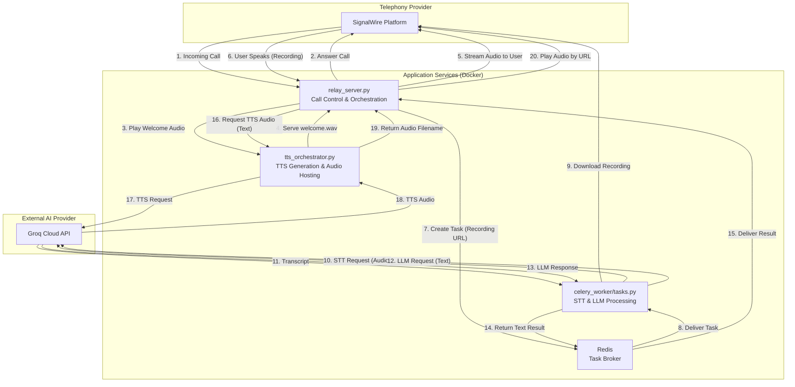

# Voice AI Assistant: System Architecture

## 1. High-Level Overview

This document outlines the architecture of the Voice AI Assistant, a sophisticated, multi-component system designed for real-time, conversational voice interactions. The system is built with a microservices approach, ensuring scalability, resilience, and a clear separation of concerns.

The core design principles are:
- **Asynchronous Processing:** Heavy computational tasks (like AI model inference) are offloaded to background workers, ensuring the main call-handling service remains responsive.
- **Separation of Concerns:** Each major function (call control, AI processing, text-to-speech) is handled by a dedicated service.
- **Scalability:** The use of Celery workers allows the system to handle a high volume of concurrent calls by scaling the number of worker instances.
- **Resilience:** The TTS service includes a fallback mechanism to a local model, ensuring continued operation even if the primary cloud service fails.

## 2. Architecture Diagram

## 3. Component Breakdown

### `relay_server.py` (The Call Conductor)
- **Role:** The primary entry point for all voice interactions. It is the only service that communicates directly with the SignalWire telephony platform.
- **Responsibilities:**
    - Listens for and answers incoming calls via the SignalWire Relay SDK.
    - Manages the call state (e.g., active, ended).
    - Orchestrates the conversation flow: plays welcome messages, records user input, and plays back AI responses.
    - Implements "barge-in" logic to allow users to interrupt the AI's speech.
    - **Delegates** all heavy processing to other services. It sends STT/LLM tasks to the `celery_worker` and requests TTS audio from the `tts_orchestrator`.

### `celery_worker/tasks.py` (The AI Powerhouse)
- **Role:** A background worker service that executes long-running, computationally expensive AI tasks.
- **Responsibilities:**
    - Receives tasks from the `relay_server` via the Redis message broker.
    - Downloads the user's voice recording from the URL provided by SignalWire.
    - Performs **Speech-to-Text (STT)** using the Groq API (`whisper-large-v3`).
    - Sends the transcribed text to a **Large Language Model (LLM)** using the Groq API (`llama3-8b-8192`) to generate a conversational response.
    - Returns the final text response to the `relay_server`.

### `tts_orchestrator.py` (The Voice Generator)
- **Role:** A dedicated FastAPI web service for generating and serving audio files.
- **Responsibilities:**
    - Exposes a `/generate-audio` endpoint that accepts text and returns a URL to a playable audio file.
    - Performs **Text-to-Speech (TTS)** generation, prioritizing the high-quality Groq TTS API.
    - Implements a **fallback mechanism** to a local Piper TTS model if the Groq API is unavailable.
    - Transcodes the generated audio into a telephony-optimized format (`pcm_mulaw`, 8kHz mono) using FFmpeg.
    - Serves the final audio files from a static directory, which can be a persistent volume.

### `redis`
- **Role:** The central nervous system for inter-service communication.
- **Responsibilities:**
    - Acts as the **Celery Message Broker**, queuing tasks from the `relay_server` and delivering them to an available `celery_worker`.
    - Can also be used for caching, though its primary role in this architecture is task queuing.

## 4. End-to-End Call Flow

A typical interaction with the Voice AI Assistant follows these steps:

1.  **Call Initiation:** A user calls the phone number associated with the SignalWire context. SignalWire routes the call to the `relay_server`.
2.  **Welcome:** The `relay_server` answers the call and immediately requests the pre-recorded welcome message from the `tts_orchestrator`'s static audio endpoint. It plays this message to the user.
3.  **User Input:** The `relay_server` listens for the user to speak. When the user finishes, the `record` action provides a secure URL to the `.wav` file stored on SignalWire's servers.
4.  **Task Delegation:** The `relay_server` creates a new task for the `celery_worker` (e.g., `get_llm_response_task`), passing the recording URL. It sends this task to the Redis queue.
5.  **AI Processing (Async):**
    - An available `celery_worker` picks up the task from Redis.
    - The worker downloads the audio file from the SignalWire URL.
    - It sends the audio to Groq for transcription (STT).
    - It sends the resulting text to Groq for conversational response generation (LLM).
6.  **Response Generation:** The `celery_worker` returns the LLM's text response. The `relay_server`, which was waiting for the task result, receives this text.
7.  **TTS Generation:** The `relay_server` makes an HTTP request to the `tts_orchestrator`'s `/generate-audio` endpoint, providing the LLM's text.
8.  **Audio Playback:** The `tts_orchestrator` generates the audio, saves it, and returns the filename. The `relay_server` constructs the full URL and instructs SignalWire to play this audio file to the user.
9.  **Loop:** The `relay_server` immediately begins listening for the user's next response, and the conversation loop continues until the user hangs up.